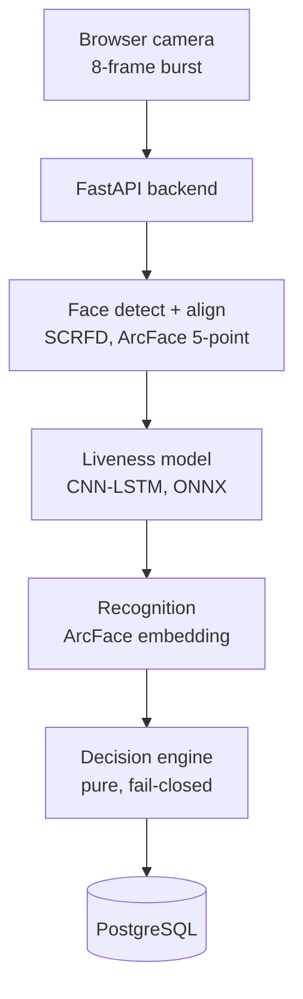

# Secure Biometric Attendance System

A trained CNN-LSTM face anti-spoofing model integrated with ArcFace identity
verification, deployed as containerised services on Kubernetes.

> Every number in this README is measured. Nothing is estimated or illustrative.
> The failed first training run is kept in `docs/results/` rather than deleted,
> because its failure is the most instructive result the project produced.

---

## 1. Problem

Face-recognition attendance is trivially defeated. Hold up a classmate's photo, or
replay a video of them on a phone, and a recognition-only system marks them present.
Proxy attendance is the actual threat, and identity matching does not address it.

The ML problem is therefore **not** "who is this person" — pretrained models solve that
well. It is:

> Given a camera stream, is this a live person or a presentation attack?

That question is the project's ML contribution. Identity verification is built on a
pretrained backbone around it.

## 2. What is and is not claimed

**Trained here:** the liveness model (CNN and CNN-LSTM), from an ImageNet-pretrained
backbone, on subject-grouped splits, evaluated with ISO/IEC 30107-3 metrics.

**Not trained here:** the face-recognition backbone. ArcFace (InsightFace `buffalo_l`)
is used pretrained. Training a face-recognition foundation model needs millions of
identities; what is built here is the enrollment, template, matching and threshold
pipeline around it.

## 3. Architecture



A single backend loads both ONNX models in-process. Separate liveness and recognition
microservices were considered and rejected: the models sit on the same request path,
scale together, and are never called independently, so splitting them would add two
network hops and two deployments to a system whose peak load is a classroom.
See `docs/01-scope.md`.

### Decision rule

Attendance is marked only if **all** of:

- exactly one face detected
- liveness confidence ≥ threshold
- identity similarity ≥ threshold, with a margin over the runner-up
- user registered and active
- an attendance session is currently open
- attendance not already marked for this (user, session)

Anything else rejects with a reason code. The engine is a pure function with a single
approval path, so any check added above it rejects by default. Rejections never return
the matched identity — otherwise `/verify` becomes an oracle for "who does this photo
most resemble".

Reason codes: `NO_FACE`, `MULTIPLE_FACES`, `LIVENESS_FAILED`,
`LOW_LIVENESS_CONFIDENCE`, `UNKNOWN_PERSON`, `LOW_IDENTITY_CONFIDENCE`,
`ALREADY_MARKED`, `NO_OPEN_SESSION`, `USER_INACTIVE`, `SYSTEM_ERROR`.

## 4. Dataset

| Role | Dataset | Contributes |
|---|---|---|
| Train + test | `trainingdatapro/attacks-with-2d-printed-masks-of-indian-people` | 21 subjects, 8 printed-mask attack variants, matched live capture |
| External test | `trainingdatapro/real-vs-fake-anti-spoofing-video-classification` | phone replay (unseen attack) |
| External test | `trainingdatapro/cut-out-printout-attacks` | printed mask, 9 further subjects |
| External test | `trainingdatapro/biometric-attacks-in-different-lighting` | display replay + live footage in 4 lighting conditions |

The primary dataset was chosen over larger alternatives because it is the only free
option with **real subject identifiers**, and because its live and spoof clips come
from the same people in the same session. That second property matters: combining a
live-only dataset with a spoof-only dataset lets a model separate the classes by camera
signature or compression artifacts rather than by spoofing cues, scoring near-perfectly
while learning nothing. Full reasoning in `docs/02-dataset.md`.

**Splitting is subject-grouped**, so the test set contains people the model has never
seen. Enforced by a checked invariant (`LeakageError`), not by convention.

Measured split:

```
split       groups   clips    live   spoof
train           12     120      24      96
val              4      40       8      32
test             5      50      10      40
test subjects: person_0, person_9, person_11, person_15, person_16
```

## 5. Preprocessing

```
video -> sampled frames -> SCRFD detection -> ArcFace 5-point alignment
      -> 112x112 crop -> ImageNet normalisation -> tensors
```

The **same detector and alignment code runs at training and serving time**. If crops
were produced differently in the two settings, the model would see a different input
distribution in production than it trained on, and the measured metrics would stop
predicting real behaviour.

Measured preprocessing yield:

| Dataset | Clips | Frames kept | Detection failures |
|---|---:|---:|---:|
| primary | 210 | 3,357 | 3 |
| real_vs_fake | 160 | 2,526 | 34 |
| printout_masks | 18 | 288 | 0 |
| lighting | 54 | 816 | 48 |

Detection failures are logged and surfaced, because a detector that fails
disproportionately on spoof clips is silently doing part of the anti-spoofing job and
would make the model's APCER look better than it is.

## 6. Models

Both architectures share one backbone (`build_backbone`), so the ablation isolates a
single variable — whether temporal modelling helps.

```
Model A (control)   frame  -> MobileNetV3-Small -> pool -> FC -> logit
Model B (main)      N=8    -> MobileNetV3-Small -> BiLSTM(128) -> FC -> logit
```

**Why temporal information should help.** A replayed video carries temporal artifacts a
single frame cannot show: screen refresh banding that moves with the display rather
than the face, absent micro-motion (blink irregularity, involuntary tremor), and
reflections fixed while the face moves. A print attack shows rigid planar motion with
no parallax.

**This dataset makes that hypothesis testable.** Four attack variants are hand-held and
four are mounted. A hand-held mask jitters; a mounted one does not. If the temporal
model helps, the gain should concentrate in the hand-held variants — the per-attack
table shows whether it does. That converts an architectural assertion into an experiment
with a predicted outcome.

**Why MobileNetV3-Small:** it must train in a free Kaggle session and run on CPU in the
deployed container (~2.5M params vs ResNet-50's ~25M). Anti-spoofing cues are largely
local texture, which does not need a high-capacity backbone; capacity is better spent
on the temporal component.

**Augmentation is applied identically across a sequence.** Per-frame augmentation would
flip frame 2 and not frame 3, injecting motion that never happened and destroying the
exact signal the LSTM exists to read.

## 7. Evaluation protocol

Per ISO/IEC 30107-3:

- **APCER** — fraction of attacks wrongly accepted as live (security failure)
- **BPCER** — fraction of real people wrongly rejected (usability failure)
- **ACER** — their mean

Accuracy is deliberately not the headline: on a 4:1 imbalanced set a model can score 90%
accuracy while accepting **every** attack. There is a test demonstrating exactly that.

**APCER is reported worst-case per attack type**, not pooled. A model that blocks every
print attack but accepts every replay shows a pooled APCER of 33% and a worst-case of
100%. An attacker uses the attack that works.

**Thresholds are selected on validation only; the test set is scored once.** External
sets are scored at that same threshold — re-tuning per set would turn them into
validation data and make the "unseen" claim false.

**Error rates are reported with 95% Wilson confidence intervals.** The test set is 5
subjects and 50 clips; a bare point estimate would imply a precision the data cannot
support.

### Results

Pooled corpus: **439 clips, 151 live, 288 spoof, 162 subjects** across four sources.
Subject-grouped split: 97 / 32 / 33 subjects (261 / 68 / 110 clips).
Threshold selected on validation (min-ACER); test scored once.

| Model | Test ACER | APCER | BPCER | ROC-AUC | Threshold |
|---|---:|---:|---:|---:|---:|
| **A single-frame CNN** | **9.74%** | 10.39% | **9.09%** | **0.951** | 0.4535 |
| B CNN + BiLSTM | 15.15% | 9.09% | 21.21% | 0.911 | 0.8759 |

95% CI (Model A): APCER [5.4, 19.2], BPCER [3.1, 23.6]. 33 live / 77 spoof test clips.

**Model A is deployed.** ONNX, 3.7 MB, max |onnx - torch| = 9.06e-06.

### Per-attack APCER — the number that matters

| Attack | A | B |
|---|---:|---:|
| display_photo_lightroom | **50.0%** | 100.0% |
| replay_phone | **35.7%** | 14.3% |
| mask_static_printedglasses | 28.6% | 14.3% |
| display_photo_nightlight | 0.0% | 100.0% |
| display_replay | 0.0% | 0.0% |
| mask_handheld (4 variants) | 0.0% | 0.0-14.3% |
| mask_static (3 other variants) | 0.0% | 0.0% |

**Worst-case APCER is 50%, against a pooled figure of 10.39%.** This is exactly why
ISO/IEC 30107-3 reports the worst attack species rather than the average: the system
blocks every printed-mask attack but accepts half of the photos displayed on a lit
screen. An attacker uses the attack that works.

### Ablation — and why the aggregate winner is misleading

Model A wins overall (9.74% vs 15.15% ACER), so the single-frame baseline is deployed
and the temporal model is not justified on this data.

But the aggregate hides the interesting part. Model B is **twice as good on the two
attacks that matter most for proxy attendance** — phone replay (14.3% vs 35.7%) and
printed-glasses masks (14.3% vs 28.6%). It loses because it fails completely on photos
displayed on screens (100% APCER on two display categories). "The single-frame CNN is
better" is true on aggregate and misleading against the actual threat model.

The original hypothesis — that temporal cues would help specifically on **hand-held**
masks, which jitter, versus mounted ones — was **not confirmed**: APCER was 0% on
hand-held and static variants alike for Model A. Attack detection on masks was never
the failure mode. That prediction is recorded as falsified rather than quietly dropped.

### Run 1: what failure taught us

The first run trained on the primary dataset alone and is documented in
`docs/results/liveness-run1-single-source.md`.

| | Run 1 (single source) | Run 2 (pooled) |
|---|---:|---:|
| Validation ACER | 0.00% | 12.92% |
| Test ACER | 31.25% | **9.74%** |
| **Test BPCER** | **60.00%** | **9.09%** |
| Live training clips | 24 | 91 |
| Subjects | 21 | 162 |

Run 1 reported **0.00% validation ACER and 60% test BPCER** — it rejected three in five
genuine users. Two independent causes:

1. **24 live clips from 12 people.** The model learned those twelve faces as "live" and
   called everything else a spoof.
2. **A threshold with zero margin.** Threshold candidates were only the *observed*
   scores, so on well-separated validation data the best threshold **is** the lowest
   live score, leaving no margin beneath it. Unseen live faces scoring fractionally
   lower were rejected. Candidates are now midpoints between consecutive scores.

A validation ACER that is *too good* was the signal. Had the frames been split randomly
instead of by subject, this project would be reporting ~0% ACER and it would be fiction.

## 8. Backend

FastAPI + SQLAlchemy + PostgreSQL, layered `api -> services -> repositories -> models`.

**Schema.** `users`, `face_embeddings`, `sessions`, `attendance`,
`verification_attempts`.

Two constraints are enforced by the **database**, not application code:

- `UNIQUE(user_id, session_id)` on attendance. An application-level "already marked?"
  check loses to concurrency: two simultaneous requests can both read *not marked*
  before either writes. The constraint is what actually holds.
- `ON DELETE CASCADE` from users to embeddings, so deleting biometrics leaves no
  orphans. Attendance is deliberately **not** cascaded — biometric data is deletable on
  request, attendance is an institutional record.

`verification_attempts` stores outcomes, scores and reasons — **never images or
embeddings**. A test fails if anyone adds such a column.

## 9. Deployment

Docker: multi-stage builds, non-root users, healthchecks, `cap_drop: ALL`. Model
weights are **mounted, not baked in** — retraining swaps a file rather than rebuilding
a 2.2 GB image.

Kubernetes (`kind`): Deployments, StatefulSet + PVCs, ConfigMap, Secret, Ingress, HPA,
resource requests and limits on every pod.

**`/health` and `/ready` are different endpoints on purpose.** `/health` reports process
liveness and never touches the database. `/ready` checks the database **and that both
models loaded**, returning 503 otherwise — a pod that is alive but cannot verify anyone
must not receive verification traffic. Models load eagerly at startup; the
`startupProbe` (`failureThreshold: 30`) covers that window.

**ArcFace weights are baked into the image.** InsightFace otherwise downloads ~300 MB
from GitHub on every pod start: slow rollouts, a hard runtime dependency on an external
host, and startup that exceeded the probe budget (a pod restarted mid-download, which is
how this was found).

**`OMP_NUM_THREADS` is pinned to the CPU limit.** ONNX Runtime sizes its thread pool
from the *node's* visible CPU count, not the cgroup quota, so a 1-CPU pod ran 8 threads
over one core and thrashed. Pinning threads and doubling the limit took end-to-end
verification from 7203 ms to 3146 ms.

### Measured inference latency

| Stage | P50 |
|---|---:|
| Liveness model (8 frames, host CPU) | 5.45 ms |
| Face detection, det_size 640 (host) | 107.23 ms |
| Face detection, det_size 320 (host) | 23.85 ms |
| **End-to-end `/verify`, deployed pod** | **3146 ms (P95 3604 ms)** |

**The trained model is not the bottleneck** — face detection is, by roughly 20x. NFR-1
targeted P95 < 2 s; the deployed system is at **3.6 s and does not meet it**. Options
are measured and listed in `docs/results/inference-latency.md`; none were applied
silently, because each trades against either the evaluated operating point or hardware
that is not available.

### Measured replica scaling

kind, single node, Intel i9-9880H (8C/16T), concurrency 16, in-cluster load generator:

| Replicas | Throughput | P50 | P95 | P99 | Errors |
|---:|---:|---:|---:|---:|---:|
| 1 | 65.5 req/s | 222 ms | 395 ms | 473 ms | 0 |
| 2 | 162.3 req/s (2.48x) | 44 ms | 291 ms | 383 ms | 0 |
| 4 | 232.8 req/s (3.55x) | 33 ms | 217 ms | 336 ms | 0 |

1→2 is superlinear because a single replica is capped by its own CPU limit and its
latency includes queueing. 2→4 is sublinear because the node's shared cores become the
bottleneck. An initial measurement through `kubectl port-forward` showed scaling making
things *slower*; that was the load generator, not the system. Documented in
`docs/results/load-test.md`.

This measures the API and database path, **not** ML inference. End-to-end verification
throughput will be dominated by inference latency, measured separately.

## 10. Security and privacy

- Only embeddings are stored, never raw face images.
- `model_version` is stored with every embedding; embeddings from different backbones
  are not comparable, so a backbone change forces re-enrollment rather than silently
  producing meaningless similarities.
- Biometric deletion (`DELETE /users/{id}/biometrics`) removes embeddings while
  preserving the attendance audit trail.
- Audit log records outcomes and reasons, never biometric data.
- Secrets via Kubernetes Secrets; none committed.
- Datasets are CC BY-NC / CC BY-NC-ND — non-commercial use only.

## 11. Limitations

- **162 subjects, 33 in test.** Better than run 1's 21/5, still small. Confidence
  intervals are reported alongside every rate.
- **Worst-case APCER is 50%** on photos shown on a lit screen. The system is not
  deployable against that attack without further work.
- **P95 latency is 3.6 s against a 2 s target.** Not met.
- **All four sources are from one vendor.** Generalisation beyond that vendor's capture
  pipeline is unmeasured; run 1's cross-dataset numbers (38-61% ACER) suggest it is poor.
- **Pooled training means no fully held-out dataset** in run 2. Cross-dataset
  generalisation is measured only by run 1.
- **No 3D mask or deepfake coverage.** Out of scope, and absent from the training data.
- **Single-node Kubernetes.** Scaling figures do not extrapolate to a multi-node cluster.
- **No demographic fairness audit.** Public FAS datasets are demographically narrow.
  The primary dataset's Indian subjects partially match the intended deployment
  population but do not constitute a fairness evaluation.
- Trained and evaluated on academic datasets; **not validated on a deployed population**.

## 12. Setup

```bash
git clone https://github.com/madhav-sharma0201/secure-biometric-attendance.git
cd secure-biometric-attendance
cp .env.example .env          # then edit thresholds and credentials

python -m venv .venv && .venv/bin/pip install -r requirements-dev.txt
.venv/bin/python -m pytest    # full test suite
```

Run the stack:

```bash
docker compose up --build     # frontend :8080, backend :8000, postgres :5432
```

Kubernetes:

```bash
kind create cluster --config kubernetes/kind-cluster.yaml
kubectl apply -f kubernetes/namespace.yaml
kubectl -n attendance create secret generic attendance-secrets \
  --from-literal=POSTGRES_PASSWORD="$(openssl rand -hex 16)" \
  --from-literal=API_KEY="$(openssl rand -hex 16)"
docker build -t attendance-backend:latest -f backend/Dockerfile .
docker build -t attendance-frontend:latest ./frontend
kind load docker-image attendance-backend:latest attendance-frontend:latest --name attendance
kubectl apply -f kubernetes/
```

Training runs on Kaggle (see `notebooks/train_liveness.ipynb`); this machine has no
CUDA GPU. The notebook falls back to CPU automatically when the assigned GPU's compute
capability is unsupported by the installed PyTorch (Kaggle's P100 is sm_60; their torch
build requires sm_70+).

The trained model is published as a release artifact rather than committed:

```bash
gh release download v1.0.0 --dir models/
# or download liveness.onnx + liveness_meta.json from the Releases page
```

The decision threshold is read from `liveness_meta.json`, so it always travels with the
model that produced it.

## 13. Documents

- `docs/00-architecture.md` — requirements and architecture
- `docs/01-scope.md` — scope decisions and what was cut
- `docs/02-dataset.md` — dataset selection and split strategy
- `docs/03-recording-protocol.md` — self-collected data protocol
- `docs/results/load-test.md` — Kubernetes scaling measurements
- `docs/results/inference-latency.md` — per-stage and deployed latency
- `docs/results/liveness-run1-single-source.md` — the failed first run and its diagnosis
- `docs/results/liveness_modelA_cnn.json`, `liveness_modelB_cnnlstm.json` — full reports
